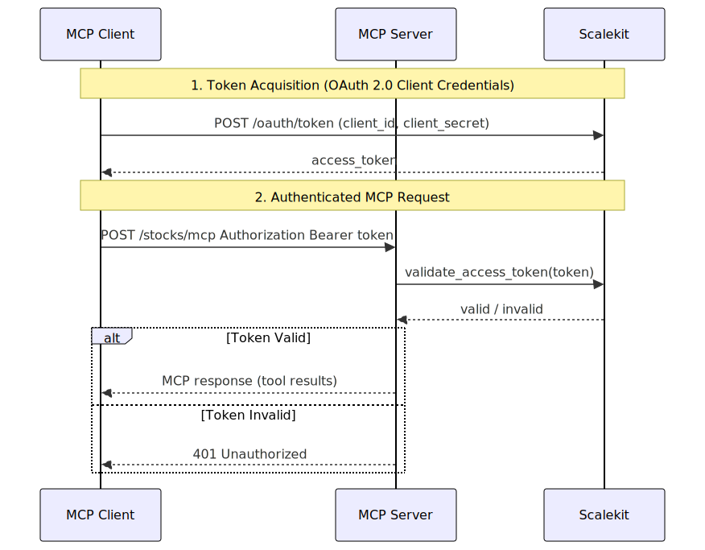

# Finance MCP Server

A production-grade **Model Context Protocol (MCP) server** that exposes Yahoo Finance stock price data as MCP tools. Built with **FastMCP** mounted on **FastAPI**, secured with **OAuth 2.0** via Scalekit, and packaged for deployment with **Docker**.

This project serves as a reference implementation for developers who want to build MCP servers in Python the right way &mdash; with proper authentication, configuration management, testing, and containerization.

---

## Table of Contents

- [Architecture Overview](#architecture-overview)
- [How MCP Works in This Project](#how-mcp-works-in-this-project)
- [Project Structure](#project-structure)
- [FastMCP: Defining Tools](#fastmcp-defining-tools)
- [FastAPI Integration: Mounting MCP on a Web Server](#fastapi-integration-mounting-mcp-on-a-web-server)
- [Authentication: OAuth 2.0 with Scalekit](#authentication-oauth-20-with-scalekit)
- [Configuration Management](#configuration-management)
- [Operational Endpoints](#operational-endpoints)
- [Containerization](#containerization)
- [Deploying to Render](#deploying-to-render)
- [Testing](#testing)
- [Getting Started](#getting-started)
- [Environment Variables](#environment-variables)

---

## Architecture Overview

<p align="center">
  
</p>

The key design idea: **FastMCP handles the MCP protocol**, while **FastAPI provides the HTTP layer** &mdash; authentication, CORS, health checks, and API docs. FastMCP is *mounted as a sub-application* inside FastAPI, giving you the best of both worlds.

---

## How MCP Works in This Project

The [Model Context Protocol](https://modelcontextprotocol.io/) defines a standard way for AI assistants to discover and call external tools. This server implements the **Streamable HTTP** transport, meaning:

1. An MCP client (e.g., Claude Desktop, Claude Code) sends a JSON-RPC request to `POST /stocks/mcp`
2. The server routes it through FastMCP, which maps `tools/call` requests to Python functions
3. The function executes (fetches stock data from Yahoo Finance) and returns structured results
4. The AI assistant receives the data and can reason over it

**Why Streamable HTTP?** Unlike `stdio` transport (which requires the MCP server to run as a subprocess of the AI client), HTTP transport lets the server run independently &mdash; as a container, a cloud service, or behind a load balancer. This is how production MCP servers should be deployed.

---

## Project Structure

```
yfinance-mcp/
├── src/finance_mcp_server/       # Application package
│   ├── __init__.py
│   ├── __main__.py               # python -m finance_mcp_server
│   ├── main.py                   # Uvicorn entrypoint
│   ├── app.py                    # FastAPI app factory
│   ├── config.py                 # Settings (pydantic-settings)
│   ├── middleware/
│   │   └── auth.py               # OAuth Bearer token validation
│   ├── mcp_servers/
│   │   └── stock.py              # FastMCP server + tool definitions
│   ├── routes/
│   │   └── ops.py                # /health, /info, /.well-known/*
│   └── misc/
│       └── art.py                # ASCII startup banner
├── tests/                        # Pytest test suite
│   ├── conftest.py               # Shared fixtures
│   ├── test_stock_tools.py       # MCP tool unit tests
│   ├── test_auth_middleware.py   # Auth middleware tests
│   ├── test_routes.py            # Route tests
│   └── test_config.py            # Configuration tests
├── local/
│   └── .env                      # Environment variables (git-ignored)
├── pyproject.toml                # Dependencies and tool config
├── Dockerfile                    # Container image
├── docker-compose.yml            # Container orchestration
├── Makefile                      # Dev commands
└── get_token.sh                  # OAuth token helper script
```

---

## FastMCP: Defining Tools

[FastMCP](https://gofastmcp.com) is the Python framework for building MCP servers. It handles protocol serialization, tool discovery, and transport negotiation so you can focus on writing tool logic.

### Creating an MCP Server Instance

```python
# src/finance_mcp_server/mcp_servers/stock.py

from fastmcp import Context, FastMCP

mcp = FastMCP(
    name="Finance MCP Server",
    instructions="Provides tools to fetch historical stock price data from Yahoo Finance.",
)
```

The `name` identifies your server in MCP client UIs. The `instructions` field tells the AI assistant what this server is for &mdash; the model uses it to decide when to call your tools.

### Defining a Tool

Tools are async functions decorated with `@mcp.tool`. FastMCP inspects the function signature to auto-generate the JSON Schema that MCP clients use for tool discovery.

```python
from datetime import date
from typing import Annotated
from pydantic import Field

@mcp.tool
async def get_stock_price(
    ticker: Annotated[str, Field(description="Stock ticker symbol, e.g. 'AAPL'")],
    start: Annotated[date, Field(description="Start date (inclusive), e.g. '2024-01-01'")],
    end: Annotated[date, Field(description="End date (inclusive), e.g. '2024-12-31'")],
    interval: Annotated[
        str,
        Field(
            description="Data interval. Valid values: '1d', '1wk', '1mo'.",
            pattern="^(1d|1wk|1mo)$",
        ),
    ] = "1d",
    ctx: Context = None,
) -> list[dict]:
    """Fetch historical closing prices for a single stock over a given time period."""
    if ctx:
        await ctx.info(f"Fetching {ticker} from {start} to {end}")
    records = await asyncio.to_thread(_ticker_history, ticker, start, end, interval)
    return records
```

Key patterns to notice:

- **`Annotated[type, Field(...)]`** &mdash; Pydantic `Field` metadata becomes the parameter description in the MCP tool schema. This is what the AI model reads to understand how to call your tool.
- **`pattern="^(1d|1wk|1mo)$"`** &mdash; Regex validation on the `interval` parameter. The MCP client enforces this before sending the request.
- **`ctx: Context`** &mdash; Optional FastMCP context for logging progress back to the MCP client via `ctx.info()`. The client can display these messages to the user.
- **`asyncio.to_thread()`** &mdash; `yfinance` is a synchronous library. Wrapping it in `to_thread` avoids blocking the async event loop. This is the correct pattern for calling sync code from async MCP tools.
- **Docstring** &mdash; FastMCP uses the function docstring as the tool description in `tools/list` responses.

### Handling Multiple Tickers with Concurrency

```python
@mcp.tool
async def get_multiple_stocks_prices(
    tickers: Annotated[list[str], Field(description="List of stock ticker symbols")],
    start: Annotated[date, Field(description="Start date (inclusive)")],
    end: Annotated[date, Field(description="End date (inclusive)")],
    interval: Annotated[str, Field(pattern="^(1d|1wk|1mo)$")] = "1d",
    ctx: Context = None,
) -> dict[str, list[dict]]:
    """Fetch historical closing prices for multiple stocks."""
    tasks = [asyncio.to_thread(_ticker_history, t, start, end, interval) for t in tickers]
    results = await asyncio.gather(*tasks)
    return dict(zip(tickers, results, strict=True))
```

`asyncio.gather()` fans out all ticker fetches in parallel. Since each `to_thread` call runs in the thread pool, this is effectively concurrent I/O without blocking the event loop.

---

## FastAPI Integration: Mounting MCP on a Web Server

The critical design decision: **FastMCP produces a FastAPI sub-application**, and we mount it inside a parent FastAPI app. This gives us full control over middleware, routing, and lifecycle.

```python
# src/finance_mcp_server/app.py

from fastapi import FastAPI
from fastapi.middleware.cors import CORSMiddleware
from fastmcp.utilities.lifespan import combine_lifespans

from .mcp_servers.stock import mcp as stock_mcp
from .middleware import AuthMiddleware

def create_app() -> FastAPI:
    # 1. Get the FastMCP sub-application
    stock_mcp_app = stock_mcp.http_app(
        path=settings.mcp_path,              # "/mcp" -- endpoint path within the sub-app
        transport=settings.mcp_transport,     # "streamable-http"
        stateless_http=settings.stateless_http,
    )

    # 2. Create the parent FastAPI app, combining lifespans
    app = FastAPI(
        title="Finance MCP Server",
        lifespan=combine_lifespans(stock_mcp_app.lifespan),
    )

    # 3. Add middleware (order matters: CORS first, then auth)
    app.add_middleware(CORSMiddleware, allow_origins=["*"], ...)
    app.add_middleware(AuthMiddleware, settings=scalekit_settings)

    # 4. Add operational routes
    app.include_router(ops_router)

    # 5. Mount MCP sub-app at /stocks
    app.mount(path="/stocks", app=stock_mcp_app)

    return app
```

### Why This Pattern Matters

| Concern | Handled By |
|---------|-----------|
| MCP protocol (JSON-RPC, tool dispatch) | FastMCP sub-app |
| HTTP transport, CORS, middleware | FastAPI parent app |
| Authentication | Custom middleware on parent |
| Health checks, service discovery | FastAPI routes on parent |
| Lifecycle management | `combine_lifespans()` merges both |

Without this pattern, you'd either have to reimplement HTTP plumbing inside FastMCP, or lose MCP protocol compliance by hand-rolling JSON-RPC over plain FastAPI. Mounting gives you both, cleanly separated.

### Transport Options

```python
stock_mcp.http_app(
    transport="streamable-http",  # Modern bidirectional HTTP streaming
    stateless_http=True,          # No session state between requests
)
```

- **`streamable-http`** (recommended) &mdash; HTTP-based transport where the server can stream multiple responses. This is the MCP spec's recommended transport for remote servers.
- **`http`** &mdash; Simpler stateless request/response. No streaming.
- **`stdio`** &mdash; Stdin/stdout, for running MCP as a subprocess. Not used with FastAPI.

### URL Routing

With `mcp_mount_path="/stocks"` and `mcp_path="/mcp"`, the final MCP endpoint is:

```
POST /stocks/mcp
```

MCP clients configure this as their server URL:

```
http://localhost:8000/stocks/mcp
```

---

## Authentication: OAuth 2.0 with Scalekit

MCP servers handling sensitive data must authenticate clients. This project implements **OAuth 2.0 Bearer Token** validation using [Scalekit](https://www.scalekit.com/) as the identity provider.

### How It Works

<p align="center">
  
</p>

### The Auth Middleware

Authentication is implemented as a Starlette `BaseHTTPMiddleware` that intercepts every request before it reaches the MCP server or any route:

```python
# src/finance_mcp_server/middleware/auth.py

from scalekit import ScalekitClient
from starlette.middleware.base import BaseHTTPMiddleware

class AuthMiddleware(BaseHTTPMiddleware):

    def __init__(self, app, settings: ScalekitSettings) -> None:
        super().__init__(app)
        self.client = ScalekitClient(
            env_url=settings.env_url,
            client_id=settings.client_id,
            client_secret=settings.client_secret,
        )

    async def dispatch(self, request: Request, call_next) -> Response:
        # Public paths bypass authentication
        if self._is_public(request.url.path):
            return await call_next(request)

        # Extract Bearer token
        auth_header = request.headers.get("Authorization")
        if not auth_header or not auth_header.startswith("Bearer "):
            return JSONResponse(
                status_code=401,
                content={"detail": "Missing or malformed Authorization header"},
            )

        token = auth_header.removeprefix("Bearer ")

        # Validate against Scalekit
        try:
            if not self.client.validate_access_token(token):
                return JSONResponse(status_code=401, content={"detail": "Invalid token"})
        except Exception:
            return JSONResponse(status_code=401, content={"detail": "Token validation failed"})

        return await call_next(request)

    def _is_public(self, path: str) -> bool:
        return any(path.startswith(p) for p in self.settings.public_paths)
```

Key design decisions:

- **Public paths** (`/health`, `/docs`, `/.well-known/`) bypass auth so health probes and OAuth discovery work without tokens.
- **Middleware, not per-route decorators** &mdash; every request is authenticated by default. You opt *out* of auth for specific paths, not opt *in*. This is safer: new routes are automatically protected.
- **ScalekitClient** handles JWT validation, signature verification, and expiry checks. You never parse tokens manually.

### Obtaining a Token

The included `get_token.sh` script acquires a token via the OAuth 2.0 Client Credentials flow:

```bash
# Using the script directly
./get_token.sh https://your-scalekit-env.scalekit.com your-client-id your-client-secret

# Or via Makefile
make get-token \
  BASE_URL=https://your-scalekit-env.scalekit.com \
  CLIENT_ID=your-client-id \
  CLIENT_SECRET=your-client-secret
```

This returns a JSON response containing an `access_token` that you pass as a Bearer header to the MCP server.

### OAuth Discovery Endpoint

The server exposes `GET /.well-known/oauth-protected-resource` so MCP clients can discover what authentication is required:

```python
@router.get("/.well-known/oauth-protected-resource")
async def oauth_protected_resource_metadata() -> dict:
    settings = get_mcp_settings()
    return json.loads(settings.auth_metadata)
```

The metadata is configured via the `AUTH_METADATA` environment variable as a JSON string. MCP clients that support [RFC 9728](https://datatracker.ietf.org/doc/html/rfc9728) can auto-discover auth requirements from this endpoint.

---

## Configuration Management

All configuration is managed through **pydantic-settings**, which provides type validation, default values, and environment variable loading from a `.env` file.

```python
# src/finance_mcp_server/config.py

from pydantic import Field
from pydantic_settings import BaseSettings, SettingsConfigDict

class MCPSettings(BaseSettings):
    model_config = SettingsConfigDict(
        env_file="local/.env",
        env_file_encoding="utf-8",
        extra="ignore",           # Ignore unknown env vars
    )

    host: Annotated[str, Field(default="0.0.0.0")]
    port: Annotated[int, Field(default=1000, ge=1, le=65535)]
    mcp_path: Annotated[str, Field(default="/mcp")]
    mcp_mount_path: Annotated[str, Field(default="/stocks")]
    stateless_http: Annotated[bool, Field(default=True)]
    mcp_transport: Annotated[
        Literal["stdio", "http", "streamable-http"],
        Field(default="streamable-http"),
    ]
```

### Why pydantic-settings?

- **Typed and validated** &mdash; `port` must be an int between 1 and 65535. `mcp_transport` must be one of three literal values. Misconfiguration fails fast at startup, not at runtime.
- **`.env` file support** &mdash; Local development reads from `local/.env`. In Docker, the same env vars are injected via `docker-compose.yml`'s `env_file`.
- **`extra="ignore"`** &mdash; The `.env` file can contain variables for both `MCPSettings` and `ScalekitSettings` without either class complaining about unknown keys.

### Singleton Pattern with `@lru_cache`

```python
@lru_cache(maxsize=1)
def get_mcp_settings() -> MCPSettings:
    return MCPSettings()
```

Settings are parsed once and cached. Every call to `get_mcp_settings()` returns the same instance, avoiding repeated file I/O and validation.

---

## Operational Endpoints

Beyond MCP tools, the server exposes standard operational endpoints on the parent FastAPI app:

| Endpoint | Purpose |
|----------|---------|
| `GET /health` | Liveness probe &mdash; returns `{"status": "ok"}`. Used by Docker healthcheck and orchestrators. |
| `GET /info` | Service metadata &mdash; server name, description, MCP endpoint URL, and a map of available tools with their descriptions. |
| `GET /.well-known/oauth-protected-resource` | OAuth discovery &mdash; returns authentication metadata so clients know how to obtain tokens. |
| `GET /docs` | Auto-generated OpenAPI documentation (built into FastAPI). |

The `/info` endpoint dynamically lists available tools by calling `stock_mcp.list_tools()`:

```python
@router.get("/info")
async def info() -> dict:
    tools = {t.name: t.description for t in await stock_mcp.list_tools()}
    return {**_INFO, "tools": tools}
```

---

## Containerization

### Dockerfile

The Dockerfile uses a two-stage dependency installation pattern for optimal caching:

```dockerfile
FROM ghcr.io/astral-sh/uv:python3.12-bookworm-slim

ENV PYTHONDONTWRITEBYTECODE=1 \
    PYTHONUNBUFFERED=1

WORKDIR /app

# Layer 1: Install dependencies (cached unless pyproject.toml or uv.lock changes)
COPY pyproject.toml uv.lock README.md ./
RUN uv sync --frozen --no-dev --no-install-project

# Layer 2: Install application code
COPY src/ ./src/
RUN uv sync --frozen --no-dev

EXPOSE 1000

ENTRYPOINT ["uv", "run", "finance-mcp-server"]
```

Key decisions:

- **`ghcr.io/astral-sh/uv`** base image &mdash; `uv` is a fast Python package manager. The image comes with Python 3.12 and `uv` pre-installed.
- **Two-stage `COPY`/`RUN`** &mdash; Dependencies are installed before copying source code. Since `pyproject.toml` and `uv.lock` change rarely, Docker caches this layer. Code changes only rebuild the final layer.
- **`--frozen`** &mdash; Uses the exact versions from `uv.lock`. No resolution at build time &mdash; deterministic, fast builds.
- **`--no-dev`** &mdash; Excludes test and dev dependencies from the production image.
- **`EXPOSE 1000`** &mdash; Documents the default port from `MCPSettings`. Note that `EXPOSE` is metadata only &mdash; the actual port is controlled by the `PORT` environment variable at runtime. Cloud platforms like Render inject their own `PORT`.
- **`PYTHONUNBUFFERED=1`** &mdash; Forces stdout/stderr to be unbuffered so logs appear in real-time in `docker logs`.

### Docker Compose

```yaml
services:
  yfinance-mcp:
    build: .
    container_name: yfinance-mcp
    ports:
      - "${PORT:-8000}:8000"
    env_file:
      - local/.env
    restart: unless-stopped
```

- **`env_file: local/.env`** &mdash; Injects all environment variables (MCP settings + Scalekit credentials) into the container.
- **`${PORT:-8000}`** &mdash; Host port is configurable; defaults to 8000 if `PORT` isn't set.
- **`restart: unless-stopped`** &mdash; The container restarts automatically on crashes but not if you explicitly stop it.

### Running

```bash
# Build and run
docker compose up --build

# Run detached
docker compose up -d --build

# View logs
docker compose logs -f yfinance-mcp

# Stop
docker compose down
```

---

## Deploying to Render

[Render](https://render.com/) can deploy this server directly from the Dockerfile. A few things to know about how Render interacts with the container:

### How Render Handles Ports

Render **ignores** the `EXPOSE` directive in the Dockerfile. Instead, it injects its own `PORT` environment variable (typically `10000`) and expects your app to bind to `0.0.0.0:$PORT`. Because `MCPSettings` uses pydantic-settings, the injected `PORT` env var automatically overrides the code default &mdash; no code changes needed.

### Environment Variables on Render

Upload your environment variables in the Render dashboard (or via an env file). **Do not include `HOST` or `PORT`**:

- **`HOST`** &mdash; Omit it. The code defaults to `0.0.0.0`, which is correct for containers. Setting it to your public Render URL (e.g., `https://your-app.onrender.com`) will cause a startup crash because uvicorn interprets it as a bind address.
- **`PORT`** &mdash; Omit it. Render injects its own `PORT` that your app picks up automatically.

The remaining variables (Scalekit credentials, auth metadata, etc.) should be set as usual:

```env
# Scalekit OAuth
CLIENT_ID=your-scalekit-client-id
CLIENT_SECRET=your-scalekit-client-secret
ENV_URL=https://your-env.scalekit.com
AUDIENCE=your-audience

# OAuth protected resource metadata (JSON string)
AUTH_METADATA='{"resource": "https://your-app.onrender.com", "authorization_servers": ["https://your-env.scalekit.com"]}'
```

### Render Service Settings

| Setting | Value |
|---------|-------|
| **Environment** | Docker |
| **Build Command** | *(auto-detected from Dockerfile)* |
| **Health Check Path** | `/health` |

### MCP Client Configuration

Once deployed, configure your MCP client to connect to the Render URL:

```
https://your-app.onrender.com/stocks/mcp
```

---

## Testing

The test suite uses **pytest** with **pytest-asyncio** for async tool testing. All external dependencies (yfinance, Scalekit) are mocked.

### Test Organization

Tests are organized by concern with pytest markers:

```toml
# pyproject.toml
[tool.pytest.ini_options]
asyncio_mode = "auto"    # No need for @pytest.mark.asyncio on every test
markers = [
    "tools: MCP tool tests",
    "middleware: auth middleware tests",
    "routes: HTTP route tests",
    "config: configuration tests",
]
```

Run specific test groups:

```bash
uv run pytest -m tools          # Only MCP tool tests
uv run pytest -m middleware      # Only auth tests
uv run pytest -m "not config"   # Everything except config tests
uv run pytest                   # All tests
```

### Shared Fixtures

```python
# tests/conftest.py

@pytest.fixture
def sample_history_df():
    """Mock yfinance Ticker.history() output."""
    idx = pd.DatetimeIndex(["2024-01-02", "2024-01-03", "2024-01-04"])
    return pd.DataFrame(
        {"Close": [153.1234, 154.5678, 155.9999], ...},
        index=idx,
    )

@pytest.fixture
def scalekit_settings():
    """ScalekitSettings with dummy values (no real Scalekit calls)."""
    return ScalekitSettings(
        client_id="test-client-id",
        env_url="https://auth.example.com",
        client_secret="test-secret",
        _env_file=None,   # Don't read from local/.env in tests
    )
```

Note `_env_file=None` on the Scalekit fixture &mdash; this prevents pydantic-settings from reading the real `.env` file during tests.

### What Gets Tested

- **Tool logic** &mdash; `_ticker_history` returns correctly formatted records, handles empty DataFrames, respects interval parameter
- **Async tools** &mdash; `get_stock_price` and `get_multiple_stocks_prices` produce expected output with mocked yfinance
- **Auth middleware** &mdash; public paths bypass auth, missing/malformed headers return 401, valid tokens pass through, invalid tokens are rejected
- **Routes** &mdash; `/health` returns ok, `/info` lists tools, `/.well-known/` returns metadata
- **Configuration** &mdash; defaults load correctly, env vars override defaults, required fields raise on missing

---

## Getting Started

### Prerequisites

- Python 3.12+
- [uv](https://docs.astral.sh/uv/) package manager
- Docker (for containerized deployment)
- A [Scalekit](https://www.scalekit.com/) account (for authentication)

### Local Development

```bash
# Clone and navigate
cd yfinance-mcp

# Install dependencies
uv sync

# Create your local env file
cp local/.env.example local/.env
# Edit local/.env with your Scalekit credentials

# Run the server
uv run finance-mcp-server

# Run tests
uv run pytest
```

### Environment Variables

Create a `local/.env` file with the following variables:

```env
# Server
HOST=0.0.0.0
PORT=8000
MCP_PATH=/mcp
MCP_MOUNT_PATH=/stocks
MCP_TRANSPORT=streamable-http
STATELESS_HTTP=true

# Scalekit OAuth
CLIENT_ID=your-scalekit-client-id
CLIENT_SECRET=your-scalekit-client-secret
ENV_URL=https://your-env.scalekit.com
AUDIENCE=your-audience

# OAuth protected resource metadata (JSON string)
AUTH_METADATA='{"resource": "https://your-server.com", "authorization_servers": ["https://your-env.scalekit.com"]}'
```

### Connecting an MCP Client

Once the server is running, configure your MCP client to connect to:

```
http://localhost:8000/stocks/mcp
```

For Claude Desktop, add to your `claude_desktop_config.json`:

```json
{
  "mcpServers": {
    "finance": {
      "url": "http://localhost:8000/stocks/mcp",
      "headers": {
        "Authorization": "Bearer <your-access-token>"
      }
    }
  }
}
```

---

## Tech Stack

| Component | Library | Purpose |
|-----------|---------|---------|
| MCP Framework | [FastMCP](https://gofastmcp.com) >= 3.1.1 | MCP protocol, tool dispatch, transport |
| Web Framework | [FastAPI](https://fastapi.tiangolo.com) >= 0.135.3 | HTTP server, middleware, routing |
| Auth Provider | [Scalekit SDK](https://www.scalekit.com/) >= 2.7.1 | OAuth 2.0 token validation |
| Configuration | [pydantic-settings](https://docs.pydantic.dev/latest/concepts/pydantic_settings/) >= 2.13.1 | Typed env var management |
| Data Source | [yfinance](https://github.com/ranaroussi/yfinance) >= 1.2.0 | Yahoo Finance stock data |
| Logging | [Loguru](https://github.com/Delgan/loguru) >= 0.7.3 | Structured logging |
| ASGI Server | [Uvicorn](https://www.uvicorn.org/) (via FastAPI) | Production async server |
| Packaging | [uv](https://docs.astral.sh/uv/) + [Hatchling](https://hatch.pypa.io/) | Fast dependency management and builds |
| Linting | [Ruff](https://docs.astral.sh/ruff/) >= 0.15.7 | Linting and formatting |
| Testing | [pytest](https://pytest.org/) + pytest-asyncio | Async-aware test framework |
| Containerization | Docker + Docker Compose | Reproducible deployment |
